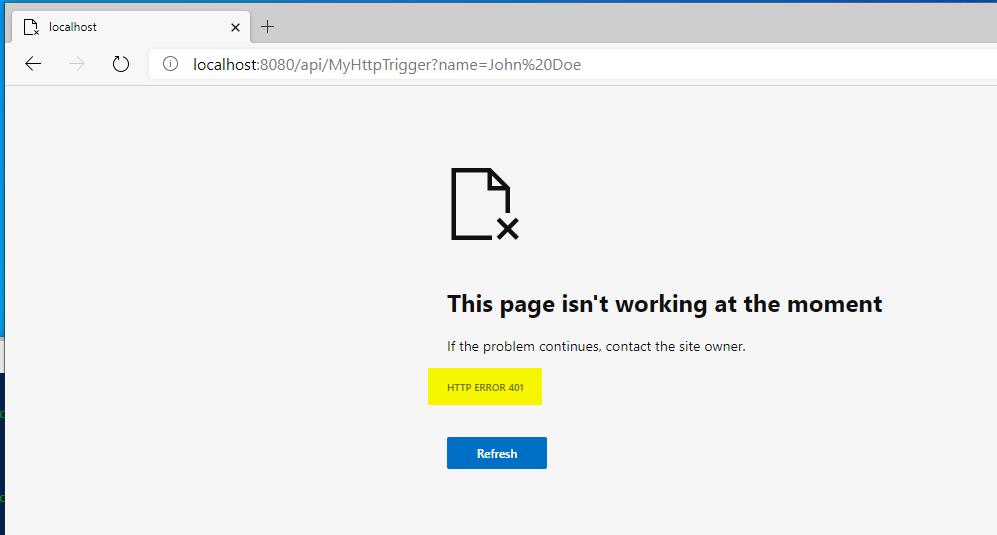

---
title: "Run Azure Function in Docker Container"
date: 2020-02-21 19:20:00
slug: "/posts/2020-02-21-run-azure-function-in-docker-container"
author: André Bering
type: article
content-type: markdown
published: true
language: en
properties:
  tags: ["docker", "Azure Function"]
toc: true
...

## Introduction

Azure Functions can basically also be executed in Docker. During development you can also execute them locally. In this context, however, there is a problem in connection with Http triggers. Although the monthly Azure Functions Webcast ([issue 20.02.2020](https://twitter.com/jeffhollan/status/1230705929051492352)) announced improvements in the area of Kubernetes Deployments, no further information is available or I could not find it.

Therefore this article shows how to use Azure Functions with a Http Trigger Docker.

<!-- more -->

## Requirements

* [Azure Functions Core Tools](https://docs.microsoft.com/de-de/azure/azure-functions/functions-run-local) >= 2.7.2184 and < 3.0
* Windows
* Docker

This article refers to the procedure using Windows. In MacOS the procedure should work the same way, only specific commands like creating directories have to be adapted.

## Create Azure Function

To create a new Azure Function project with an Http Trigger and Dockerfile, simply execute the following commands. As runtime for the creation we select 'dotnet'.

    mkdir funcDemoDocker
    cd funcDemoDocker
    func init
    func new --name MyHttpTrigger --template "HttpTrigger
    func init --docker-only

The project can then be started directly and the Azure Function can be executed in the CLI.

    func start --build

Afterwards you can call the Azure Function in the browser as usual.

{.lb .lb-img-noborder width="100%" noborder="yes"}

The project also contains the appropriate docker file to create the necessary docker image.

    docker build -t funcdemodocker .

After the image is created, we can start a container.

    docker run -p 8080:80 funcdemodocker

If you now call up the administration page of the Azure Function, you will see that it has started normally.

{.lb .lb-img-noborder width="100%" noborder="yes"}

But if you try to access the Http trigger, you get a 401 (Unauthorized) error.

{.lb .lb-img-noborder width="100%" noborder="yes"}

This is because the authentication of the Azure Function is deactivated during local execution using the CLI. This is not the case when executing in Docker.

## Solution

To solve this problem, you only have to define the keys and tell the container or more precisely the Azure Function Runtime by means of parameters where to find them. To do this, the file with the keys must first be created. In this case this file is created in the directory `C:\dev\my-secrets` with the name `host.json`. The contents of the file should look like the following:

    {
        "masterKey": {
            "name": "master",
            "value": "<key>"
            "encrypted": false
        },
        "functionKeys": [{
            "name": "default",
            "value": "<key>"
            "encrypted": false
        }]
    }

The `<key>` can be replaced by any value, for tests e.g. `test1234`. To then start the container, the following command is executed.

    docker run -v C:\dev\my-secrets:/azure-functions-host/Secrets -e AzureWebJobsSecretStorageType=files -p 8080:80 funcdemodocker

Afterwards you can address the Http trigger as usual using the key.

{.lb .lb-img-noborder width="100%" noborder="yes"}

## Conclusion

Using the way described above you can also run Azure Functions with Http Trigger in a docker container. The problem of unknown keys is solved by setting them explicitly. As mentioned above, this workaround should be fixed in the next version of the Azure Functions Core Tools and the keys will be generated automatically and displayed on startup.
