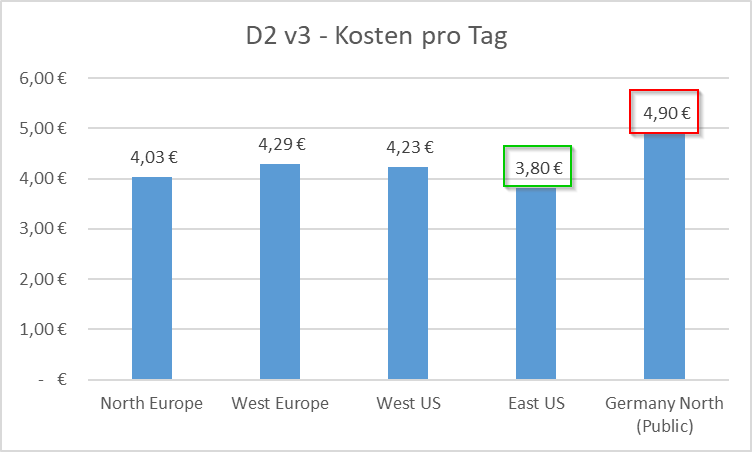
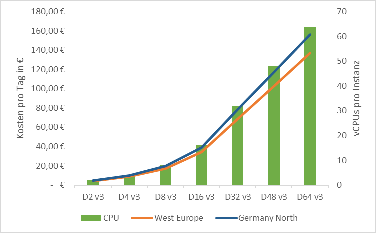
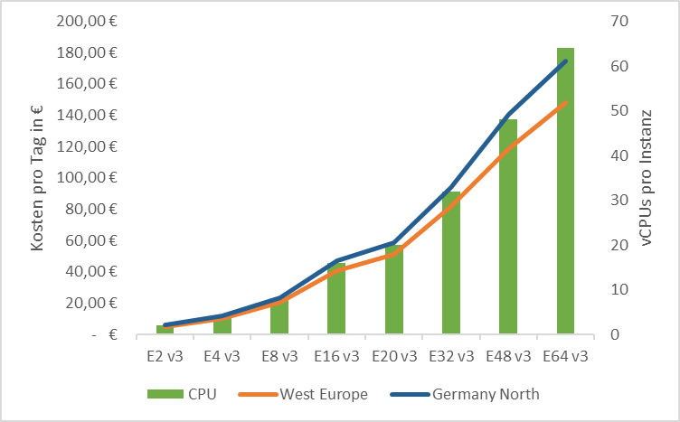

---
title: "virtuelle Maschinen in Azure - Regionen und Kosten"
language: de
date: 2020-05-05 08:30:00
slug: "/de/posts/2020-05-05-virtuelle-maschinen-in-azure-regionen-und-kosten"
author: André Bering
type: article
content-type: markdown
published: true
language: de
properties:
  tags: ["Azure", "Azure Governance"]  
toc: true
...

{.lb .lb-img-noborder width="100%" noborder="yes"}

Bei einem möglichen (Teil-)Umzug virtueller Maschinen aus dem eigenen Rechenzentrum (RZ) nach Azure, muss auf jeden Fall auch die Kostenseite betrachtet werden. Hierzu sollten im ersten Schritt die Kosten für den Betrieb der Maschinen im eigenen RZ (direkt [^direkt] und indirekt [^indirekt]) ermittelt werden, damit man diese dann den Kosten (direkt) in Azure gegenüberstellen kann.
Bei dieser Gegenüberstellung kann man die in Azure anfallenden Kosten optimieren, in dem für den anfallenden Workload die jeweils passende virtuelle Maschine ausgewählt wird.

<!-- more -->

Nachfolgend wird davon ausgegangen, dass die virtuellen Maschinen nach dem sogenannten »Lift and Shift« Prinzip migriert werden. D.h. diese werden eins zu eins ohne Optimierung der jeweiligen Services nach Azure migriert. An dieser Stelle sei auch die Anmerkung erlaubt, dass dieses Vorgehen nicht zwangsläufig den besten Weg darstellt, sondern im Rahmen einer Migration in jedem Fall auch über Innovation von Services/Diensten nachgedacht werden muss.

**Nachfolgend wird keine Empfehlung für eine generelle Umsetzung ausgesprochen. Dieser Ansatz soll lediglich dazu dienen belastbare Zahlen zu ermitteln, die im Rahmen einer Entscheidungsfindung genutzt werden können.**

## Auswahl der VM-Typen

Microsoft fasst die zur Verfügung stehenden VM-Typen in verschiedenen Gruppen oder auch Serien zusammen ([Größen für virtuelle Windows-Computer in Azure](https://docs.microsoft.com/de-de/azure/virtual-machines/windows/sizes)). Dies sind im Einzelnen:

* [Allgemeiner Zweck](https://docs.microsoft.com/de-de/azure/virtual-machines/sizes-general)
* [Computeoptimiert](https://docs.microsoft.com/de-de/azure/virtual-machines/sizes-compute)
* [Arbeitsspeicheroptimiert](https://docs.microsoft.com/de-de/azure/virtual-machines/sizes-memory)
* [Speicheroptimiert](https://docs.microsoft.com/de-de/azure/virtual-machines/sizes-storage)
* [GPU](https://docs.microsoft.com/de-de/azure/virtual-machines/sizes-gpu)
* [High Performance Computing](https://docs.microsoft.com/de-de/azure/virtual-machines/sizes-hpc)

Die am häufigsten verwendeten Maschinen dürften »Allgemeiner Zweck« und »Arbeitsspeicheroptimiert« sein. Daher wird bei der weiteren Betrachtung in der Hauptsache auf diese beiden eingegangen. Da die deutschsprachigen Bezeichnungen m.M.n. etwas sperrig sind, werden im weiteren Verlauf die englischen Bezeichnungen »Memory optimized« (MO) und »General purpose« (GP) verwenden.

## »Memory optimized« vs. »General purpose«

Der Hauptunterschied zwischen diesen Maschinentypen ist das Verhältnis von CPU und Arbeitsspeicher. Die jeweiligen Typen haben unterschiedliche Kostenstrukturen. Eine »[D2 v3](https://docs.microsoft.com/en-us/azure/virtual-machines/dv3-dsv3-series)« Maschine hat bspw. ein Verhältnis von 1:4, also 4 GB RAM zu einer vCPU. Eine »[E2 v3](https://docs.microsoft.com/en-us/azure/virtual-machines/ev3-esv3-series)« Maschine dahingegen weist ein Verhältnis von 1:8, also 8 GB RAM zu einer vCPU, auf.

Bei genauerer Betrachtung der Kosten einer Serie, stellt man schnell fest, dass sich das Verhältnis von CPU/RAM sich nahezu parallel zum Preis entwickelt.

Nachfolgend eine Visualisierung der Kosten für die D- und E-Serie.

{.lb .lb-img-noborder width="100%" noborder="yes"}

{.lb .lb-img-noborder width="100%" noborder="yes"}

Die Grafiken wurden auf Basis der Stundenpreise erstellt, die am **30.04.2020** abgerufen wurden.

## Azure Regionen

Wie man den oben stehenden Grafiken entnehmen kann, spielt auch die Auswahl der Azure Region auch bei der Kostenbetrachtung eine wichtige Rolle.

In diesem Fall wurden die Regionen »West Europe« (WE) und »Germany North (Public)« (GN) gegenübergestellt.

Schaut man sich hier bspw. die größte verfügbare Maschine der D-Serie an, so beträgt der Preisunterschied zwischen WE und GN **19,11€ pro Tag** zu Gunsten von WE. In einem Monat ergibt sich so eine Differenz von fast **600€**.

## Auswahl der richtigen Größe

Noch wichtiger bei der Auswahl einer VM ist aber die Wahl der richtigen Größe. Hierbei sollte das Augenmerk vor allen Dingen auf die Auslastung der Maschinen gelegt werden. Idealerweise sollte eine Maschine > 50% und im besten Fall > 80% ausgelastet sein. Liegt die Auslastung unter 50% sollte der Wechsel auf die nächstkleinere Größe in Erwägung gezogen werden.

Wechselt man bspw. in der Region WE von »D8 v3« auf »D4 v3« spart man 50% der Kosten pro Tag. Konkret 17,16€ zu 8,58€. Hieran wird deutlich, dass das größte Einsparungspotenzial bei der Wahl der passenden Maschinengröße vorhanden ist.

## Fazit

Es kann Gründe für die Wahl einer spezifischen Azure Region geben, bspw. Compliance. Bei der Auswahl sollten aber auch immer die Kosten berücksichtigt werden, da hier großes Einsparungspotenzial vorhanden ist, das nicht immer auf den ersten Blick ersichtlich ist.

Noch wichtiger ist es aber die Auslastung der Maschinen im Blick zu halten. Hier sollte eine Auslastung > 50% erreicht sein und sonst der dynamische Wechsel auf eine kleinere Maschine erfolgen.

[^direkt]: Kosten die einem Asset oder Service direkt zugeordnet werden können. Anschaffungskosten sind ein gutes Beispiel hierfür.
[^indirekt]: Verwaltungskosten sind ein gutes Beispiel für indirekte Kosten. Hierzu zählen bspw. auch Kosten für die Sicherheit des Rechenzentrums oder das Barcode-Etikett, welches an einem bestimmten Server angebracht ist.