---
title: "Application Lifecycle Management (ALM) und Power Apps"
language: de
date: 2020-08-11 10:00:00
slug: "/de/posts/2020-08-11-application-lifecycle-management-alm-und-power-apps"
author: André Bering 
type: article
content-type: markdown
published: true
language: de
properties:
  tags: ["Power Apps", "ALM", "Azure DevOps"]
  
toc: true
...

## Einführung

Dieser Artikel wird erklären, wie man Application Lifecycle Management (ALM) in Azure DevOps für Power Apps anwenden kann. Es wird gezeigt wie die benötigte Azure DevOps Umgebung eingerichtet wird. Weiterhin wird beschrieben, wie Quellcode/Power Apps versioniert werden kann/können, Qualitätssicherung durchgeführt und im Anschluss in die Produktionsumgebung ausgeliefert werden kann.

Die Entstehungsgeschichte des Artikels ist länger. Der erste Entwurf wurde von mir schon im Jahr 2019 geschrieben. In der Zwischenzeit habe ich immer wieder daran gearbeitet. Was mich letztendlich von der Veröffentlichung abgehalten hat, war das meiner Meinung nach noch nicht "__fertige__" Tooling der »[Übersicht über Buildtools für Azure DevOps - Power Apps | Microsoft Docs](https://docs.microsoft.com/de-de/powerapps/developer/common-data-service/build-tools-overview)«. Das ursprünglich verfügbare Tooling (Azure DevOps Extension) ist jetzt zwar immer noch verfügbar aber seit dem Sprung auf Version auf 0.3.7 als »DEPRECATED« gekennzeichnet worden. Schon seit dem Versionssprung von 0.1.16 zur Version 0.3.6 wurde das ursprüngliche Tooling grundlegend überarbeitet/verbessert. 

In Version 0.1.16 mussten noch zum Einrichten der Verbindung die Zugangsdaten (Benutzername/Passwort) im Klartext hinterlegt werden. Seit der Version 0.3.6 kann diese Authentifizierung endlich mittels [Service Principals](https://docs.microsoft.com/de-de/azure/active-directory/develop/app-objects-and-service-principals) abgebildet werden.

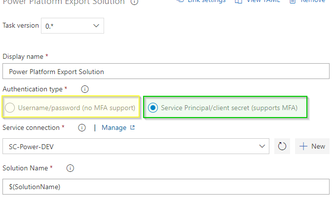{.lb .lb-img-noborder lb-cust-margin width="100%" noborder="yes"}
*Abbildung: Authentifizierungsmethoden*

Die alte (**<ins>nicht zu empfehlende</ins>**) Methode (gelb) steht weiter zur Verfügung. Somit ist der Übergang auf die neue Option (grün) nahtlos möglich, auch für Nutzer die bereits vorherige Versionen der BuildTools verwendet haben oder noch keine Service Principals eingerichtet haben. **Beim Umstieg auf die oder Beginn mit der aktuellen Version der Build Tools sollte auf jeden Fall der Wechsel auf die Service Principals erfolgen**.

Zwei Versionen sind im Visual Studio Marketplace verfügbar:
1. **[Power Platform Build Tools - Visual Studio Marketplace](https://marketplace.visualstudio.com/items?itemName=microsoft-IsvExpTools.PowerPlatform-BuildTools&targetId=e326b11d-3605-4a6e-903e-4bff6ccc155d&utm_source=vstsproduct&utm_medium=ExtHubManageList)**  
2. (**DEPRECATED**) [PowerApps BuildTools - Visual Studio Marketplace](https://marketplace.visualstudio.com/items?itemName=microsoft-IsvExpTools.PowerApps-BuildTools&targetId=e326b11d-3605-4a6e-903e-4bff6ccc155d&utm_source=vstsproduct&utm_medium=ExtHubManageList)

Wie zuvor beschrieben ist diese Extension [2] mittlerweile als »**DEPRECATED**« gekennzeichnet, daher sollte nur noch [1] verwendet werden.  
Die Werkzeuge, die aktuell für Azure DevOps verfügbar sind, sind grundlegend ein Wrapper um den SolutionPackager für D365 Customer Engagement (CRM).

Die finale Architektur, für die Integration von Azure DevOps und Power Plattform, wird auf abstrakter Ebene wie folgt aussehen.

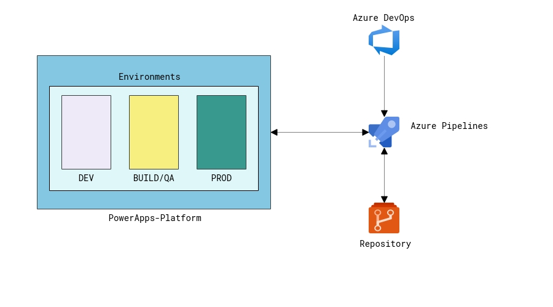{.lb .lb-img-noborder lb-cust-margin width="100%" noborder="yes"}
*Abbildung: Architektur Übersicht*

Microsoft selbst schlägt zwei verschiedene Vorgehensweisen für ALM in Verbindung mit der Power Plattform vor. [^1] In dieser Anleitung wird die erste Variante beschrieben, bei der nur der Quellcode versioniert wird, aber nicht die gepackten Solutions. Im Kontext klassischer Softwareentwicklung ist dies auch der _normale_ Weg, weil sonst auch nur Quellcode und nicht kompilierte Binaries versioniert werden.

<!-- more -->

## Anforderungen

Grundlegend werden einige Dinge benötigt, um die Schritte nachvollziehen zu können. Die nachfolgende Komponenten werden benötigt.

* 3 Power Apps Umgebungen (bspw. [Microsoft 365-Entwicklerabonnements](https://docs.microsoft.com/en-us/office/developer-program/office-365-developer-program-get-started) mit drei Konten im Tenant jeweils mit [Power Apps-Communityplan](https://powerapps.microsoft.com/de-de/communityplan/) verbunden)
* 1 Azure DevOps Projekt
  * installierte [Power Apps build tools Azure DevOps Erweiterung](https://docs.microsoft.com/de-de/powerapps/developer/common-data-service/build-tools-overview)
  * 1 Git Repository
* 1 Service Principal

<aside class="article-alert article-alert-warning">
	

		
	

    
        
        Wenn ein Microsoft 365-Entwicklerabonnement eingesetzt wird, muss Klarheit darüber bestehen, dass dieses nach 90 Tagen abläuft, falls keine M365 Entwicklung durchgeführt wurde. Für die Verlängerung ist es ausreichend, dass bspw. ein <a href="https://docs.microsoft.com/de-de/sharepoint/dev/spfx/web-parts/get-started/build-a-hello-world-web-part">SharePoint Web Part</a> erstellt/entwickelt wird.
    

</aside>

## Los geht's {#getting-started}

Wie zuvor erwähnt werden drei Umgebungen benötigt, um dieser Anleitung folgen zu können. Für die nachfolgenden Schritte werden die folgenden Umgebungen mit der entsprechenden Bedeutung verwendet.

| Name                         | Function | 
| ---------------------------- | :-----:  |
| André Bering's Environment   | DEV      |
| Johanna Lorenz's Environment | BUILD/QA |
| Alex Wilber's Environment    | PROD     |

Wie zu sehen ist, sind diese drei Umgebungen im [Power Platform Admin Center](http://aka.ms/ppac) sichtbar.

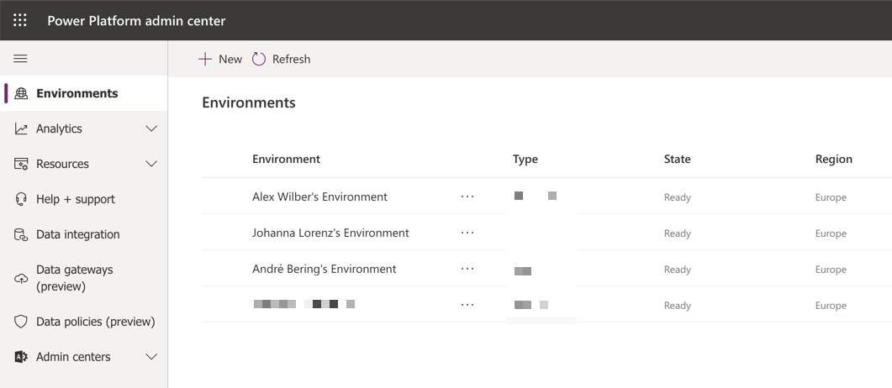{.lb .lb-img-noborder lb-cust-margin width="100%" noborder="yes"}
*Abbildung: Umgebungsübersicht*

Mit einem Hintergrund als Entwickler kommt als erstes vielleicht die Frage auf, wie die Arbeit in der Power Platform versioniert werden kann. Zur Zeit gibt es leider keinen einfachen Weg dies zu tun. Der einzige Weg ist manuell die Lösung herunterzuladen, diese zu entpacken und die Inhalte dann zu versionieren.

Dieser Prozess kann mittels ALM in Azure DevOps abgebildet werden, sogar mit einer Art von CI/CD Ansatz.  
Der Artikel basiert in der Hauptsache auf dem Tutorial von Microsoft für die Power Apps Build Tools, das [hier](https://github.com/microsoft/PowerApps-Samples/tree/master/build-tools) zu finden ist.

Für das Tutorial und die weiteren Schritte wird die URL der jeweiligen Umgebung benötigt. Die URL ist im [Admin Center](https://aka.ms/ppac) zu finden.

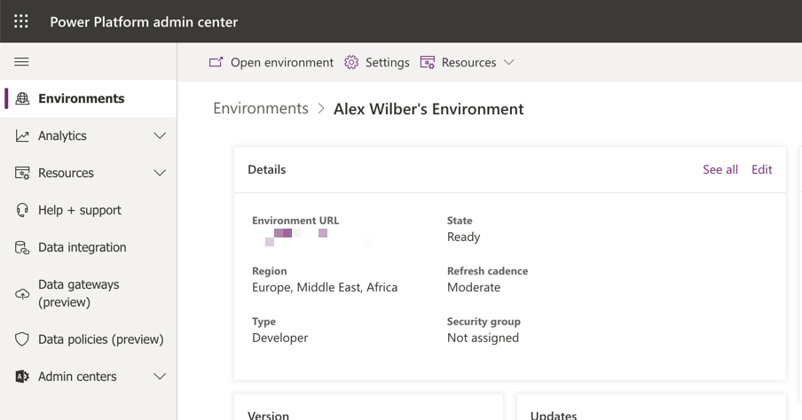{.lb .lb-img-noborder lb-cust-margin width="100%" noborder="yes"}
*Abbildung: Admin Center - Environment URL*

Falls irgendeine Form von ALM mit Power Apps eingesetzt werden soll, muss zunächst verstehen werden wie Lösungen in diesem Kontext funktionieren. Um diese Grundlagen zu verstehen kann dieser Microsoft Docs Artikel gelesen werden: [Arbeiten mit Lösungen in Power Apps - Power Apps | Microsoft Docs](https://docs.microsoft.com/de-de/powerapps/maker/common-data-service/solutions-overview)

In diesem Artikel ist noch eine weitere Einführung verlinkt, die auch gelesen werden sollte: [Einführung in Lösungen - Power Apps | Microsoft Docs](https://docs.microsoft.com/de-de/powerapps/developer/common-data-service/introduction-solutions)

## Service connections / Service Principals {#service-principal}

Um die Verbindung in Azure DevOps einrichten zu können, muss der entsprechende Service Principal in Azure DevOps eingerichtet bzw. hinterlegt werden werden. Den entsprechenden Menüpunkt befindet sich unterhalb von »_**Project Settings - Pipelines - Service connection - New service connection**_«.

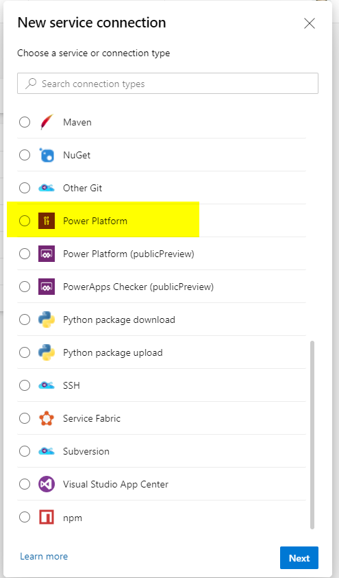{.lb .lb-img-noborder lb-cust-margin width="100%" noborder="yes"}
*Abbildung: Azure DevOps Service - Create new service connection*

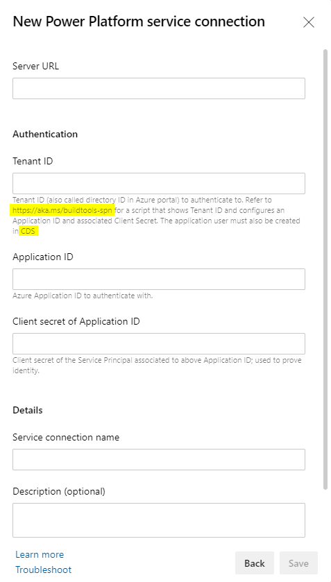{.lb .lb-img-noborder lb-cust-margin width="100%" noborder="yes"}
*Abbildung: Azure DevOps Service connections*

Im Dialog wird auf zwei Stellen verwiesen, die helfen sollen, den entsprechenden Zugang anzulegen bzw. an der richtigen Stelle zu hinterlegen. Der erste Link verweist auf eine Anleitung in Microsoft Docs. Dort wird empfohlen die Anlage mittels verlinktem PowerShell-Skript durchzuführen. Das Skript kann allerdings nur unter Windows ausgeführt werden, weil die verwendeten PowerShell Module zwingend »System.Forms« benötigen und eben diese nur unter Windows zur Verfügung stehen. Daher empfehle ich, dass der Service Principal direkt im Azure Portal erzeugt wird. Die entsprechende Dokumentation ist im Fließtext der Anleitung verlinkt.


Der Service Principal muss in dem Tenant angelegt werden, in dem sich die Power Apps Umgebungen befinden.


[Verwenden der Einzel-Mandanten-Server-zu-Server-Authentifizierung (Common Data Service) - Power Apps | Microsoft Docs](https://docs.microsoft.com/de-de/powerapps/developer/common-data-service/use-single-tenant-server-server-authentication#azure-application-registration)

Nachdem der/die Service Principal/s in Azure in angelegt wurden, kann die Einrichtung fortgesetzt werden.

Entscheidend ist, dass es **nicht** wie in der Anleitung den Punkt »**Settings**« gibt, sondern den Punkt »**Advanced Settings**«. Über diesen Punkt kann die entsprechende Oberfläche aufgerufen werden. 

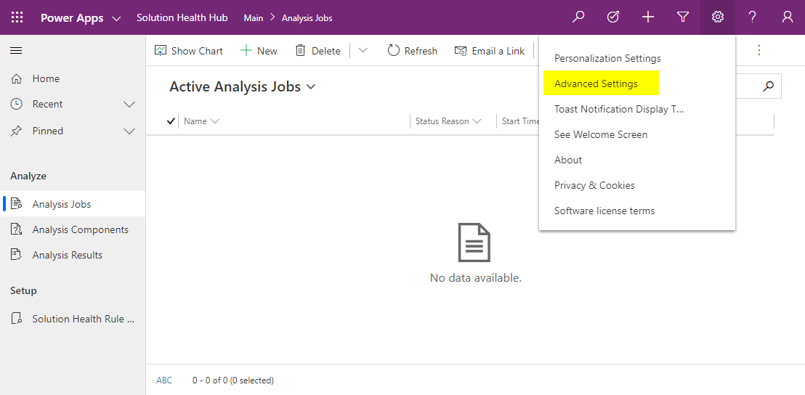{.lb .lb-img-noborder lb-cust-margin width="100%" noborder="yes"}
*Abbildung: Einstellungen - Erweiterte Einstellungen*

An dieser Stelle kann Verwunderung eintreten, wenn die Dynamics 365 Oberfläche erscheint. Die beiden Plattformen sind sehr eng miteinander verzahnt, so dass bestimmte Einstellungen aktuell nur (immer noch) in der _alten_ Oberfläche zu finden sind. Die Umstellung auf eine durchgehende Verwaltungsoberfläche ist ein fortlaufender Prozess. Daher ist davon auszugehen, dass die Punkte in Zukunft auch in die Power Plattform Oberfläche bzw. ein einheitliches Look & Feel integriert werden.

In der Microsoft Dokumentation gibt es noch einen Stolperstein, nämlich bei der Anlage des Benutzers. Das Verhalten hinsichtlich dieses Stolpersteins war aber nicht konsistent.  
Daher nachfolgend die einzelnen Dialoge, die abgearbeitet werden müssen, um den Service Principal innerhalb der Power Plattform Umgebung bekannt zu machen. 

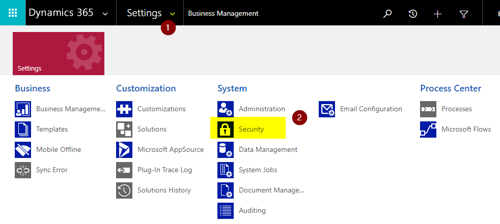{.lb .lb-img-noborder lb-cust-margin width="100%" noborder="yes"}
*Abbildung: D365 Settings*

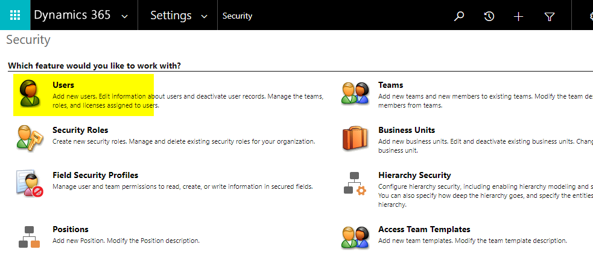{.lb .lb-img-noborder lb-cust-margin width="100%" noborder="yes"}
*Abbildung: D365 Security*

In der Benutzerliste Ansicht auf »Application Users« filtern und im Anschluss »+ NEW« klicken.

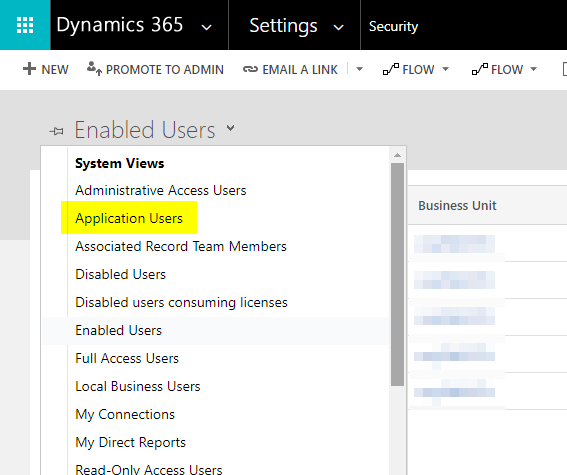{.lb .lb-img-noborder lb-cust-margin width="100%" noborder="yes"}
*Abbildung: Benutzeransicht filtern*

Vor der Eingabe der Daten muss der Dialog noch mittels Auswahl von »Application User« auf den richten Modus umgestellt werden.

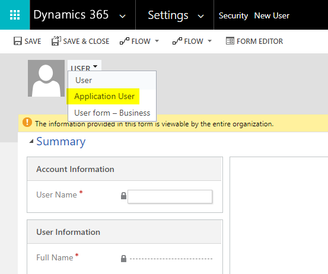{.lb .lb-img-noborder lb-cust-margin width="100%" noborder="yes"}
*Abbildung: Auswahl 'Application User'*

Bei der Eingabe der Daten müssen die Informationen verwendet werden, die man zuvor bei Anlage des Service Principal im Azure Portal definiert hat. Der Benutzer benötigt (weil es ein Pflichtfeld der Form ist) ebenfalls eine E-Mail Adresse, auch wenn es sich nur um einen technischen Benutzeraccount handelt. Hier können bspw. Adressen sogenannter Beispieldomains ([Beispieldomains – Wikipedia](https://de.wikipedia.org/wiki/Beispieldomains)) verwendet werden, wie auch im folgenden Screenshot zu sehen ist. Die Adresse wird aber nicht für den Versand von E-Mails verwendet.  
Nach Anlage des Benutzers durch Betätigen der Schaltfläche »SAVE« den Dialog **nicht** schließen.

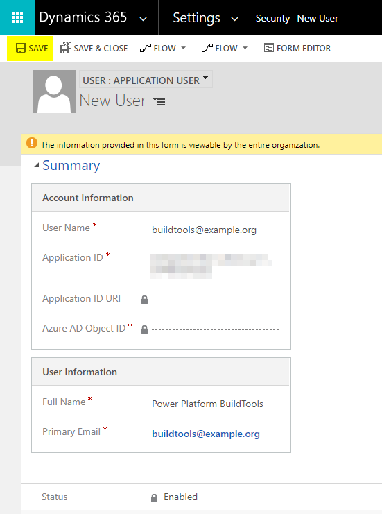{.lb .lb-img-noborder lb-cust-margin width="100%" noborder="yes"}
*Abbildung: Eingabe Benutzerdaten*

Über die Schaltfläche »MANAGE ROLES« muss dem Benutzeraccount noch die notwendige Rolle zugewiesen werden.

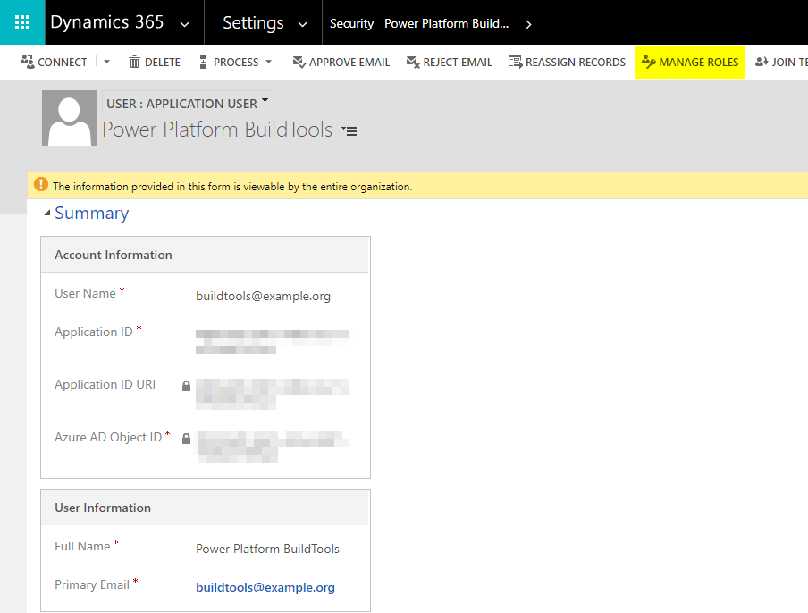{.lb .lb-img-noborder lb-cust-margin width="100%" noborder="yes"}
*Abbildung: Rollenzuweisung aufrufen*

Damit alle notwendigen Aktionen mit diesem Benutzeraccount durchgeführt werden können, muss die Rolle »System Administrator« zugewiesen werden. Ansonsten kommt es später im Kontext der Verwendung durch die Azure DevOps Pipelines zu Fehlern.

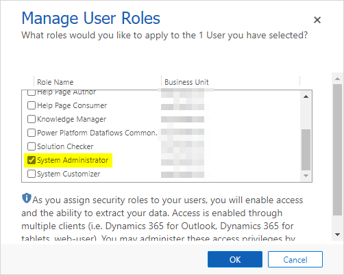{.lb .lb-img-noborder lb-cust-margin width="100%" noborder="yes"}
*Abbildung: Auswahl Benutzerrolle*

Nach diesen Schritt ist der Zugang eingerichtet und kann nun in Azure DevOps hinterlegt werden. Hierzu muss der Dialog verwendet werden, der zu Beginn dieses Abschnitts (»[Service connections / Service Principals]()«) zu sehen/beschrieben ist.

Für jede Power Plattform Umgebung muss eine individuelle Service Connection angelegt werden. Insgesamt muss die zuvor beschriebene Einrichtung drei Mal vorgenommen, wobei der Service Principal nicht drei Mal angelegt werden muss. Dieser kann in jeder Umgebung als Benutzeraccount hinterlegt werden.  
Alternativ kann natürlich auch pro Umgebung jeweils ein separater Service Principal angelegt werden.

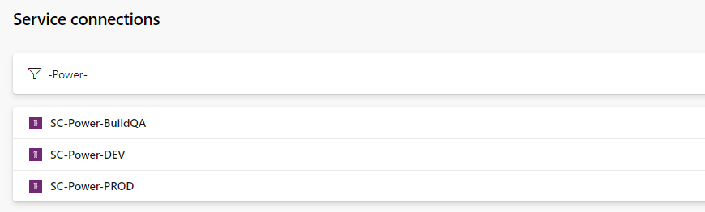{.lb .lb-img-noborder lb-cust-margin width="100%" noborder="yes"}
*Abbildung: Azure DevOps Service connections Liste*

Danach alle benötigten Verbindungen mit den jeweiligen Informationen/Zugangsdaten pro Umgebung anlegen.

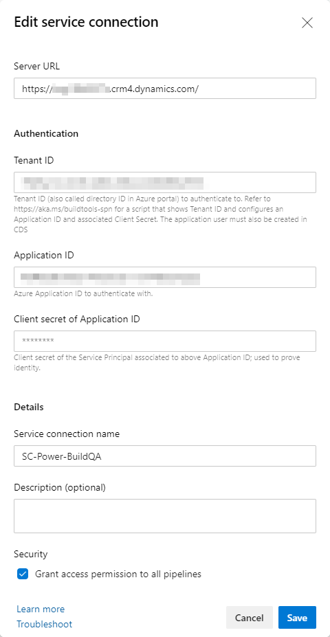{.lb .lb-img-noborder lb-cust-margin width="50%" noborder="yes"}
*Abbildung: Azure DevOps Service connection Eigenschaften*

Wie im Abschnitt »[Los geht's]()« beschrieben, wird die URL der Umgebung benötigt und dieser Wert wird als »_**Server URL**_« in Eigenschaften der Service Connection hinterlegt.

## Azure DevOps Pipelines

### Einleitung

Nach Anlage der Service Connections müssen jetzt die Pipelines und Releases eingerichtet werden. Diese werden genutzt um den Quellcode aus »DEV« zu extrahieren, eine Managed Solution in »QA/Build« zu erzeugen und diese Solution dann in »PROD« auszurollen.

Für die ersten beiden Schritte wird jeweils eine Pipeline benötigt.

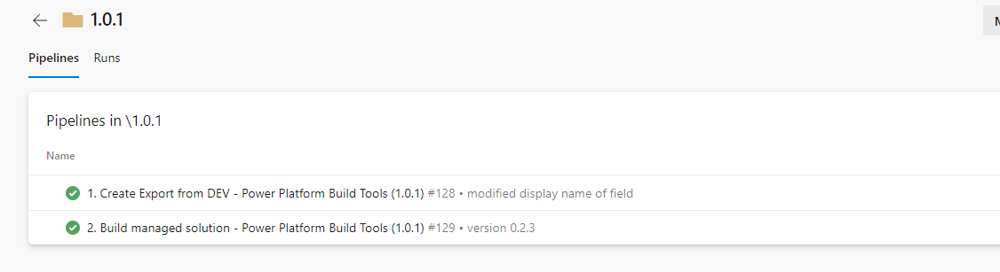{.lb .lb-img-noborder lb-cust-margin width="100%" noborder="yes"}
*Abbildung: Liste Azure DevOps Pipelines*

Für das letztendliche Deployment Richtung PROD wird dann ein Azure DevOps Release verwendet.

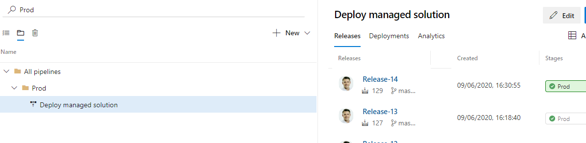{.lb .lb-img-noborder lb-cust-margin width="100%" noborder="yes"}
*Abbildung: Liste Azure DevOps Releases*

### Berechtigungen Repository

Unterhalb von »_**Project Settings - Repos - Repositories User**_« muss dem Account »_**\<Azure DevOps Project Name\> Build service \(\<Organization name\>\)**_« die »_**Contribute**_« Berechtigung erteilt werden. Andernfalls kann die Build Pipeline nicht den Quellcode in das Repository pushen.

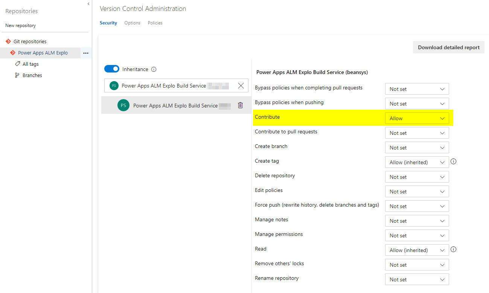{.lb .lb-img-noborder lb-cust-margin width="100%" noborder="yes"}
*Abbildung: 'Build Service' Berechtigungen*

### Lösung exportieren

In der Pipeline für den Export der Solution sind vier Schritte und ein weiterer für das hinzufügen des Code zum Repository notwendig.

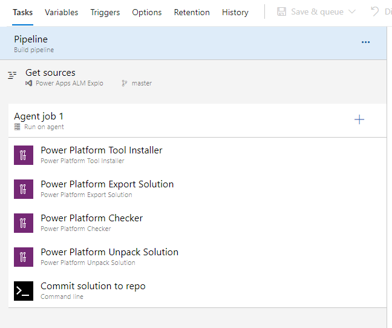{.lb .lb-img-noborder lb-cust-margin width="100%" noborder="yes"}
*Abbildung: Azure DevOps Pipeline Tasks*

Um den Quellcode zum Repository hinzuzufügen, sind ein paar Kommandozeilenbefehle notwendig, damit Git automatisiert im Kontext der Pipeline ausgeführt wird.

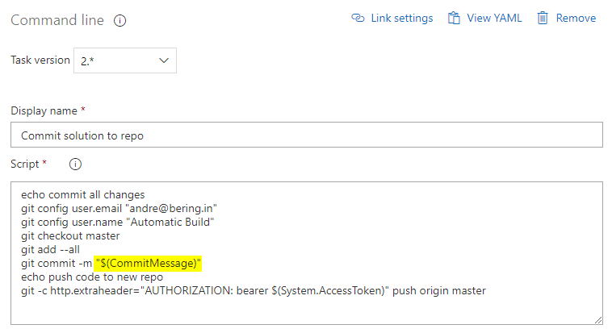{.lb .lb-img-noborder lb-cust-margin width="100%" noborder="yes"}
*Abbildung: Azure DevOps Pipeline Command line task*

Hervorzuheben ist hierbei die Variable. Diese muss/kann beim Starten der Queue gesetzt werden. Somit kann der jeweiligen Commit-Kommentar immer dynamisch beim jeweiligen Durchlauf gesetzt werden. Der Code für diesen Task findet sich im folgenden Abschnitt.

#### Quellcode in Repository

Der Code wird im letzten Schritt »Commit solution to repo« verwendet, um den Code zum Repository hinzuzufügen.

    echo commit all changes
    git config user.email "<E-Mail address of commit user""
    git config user.name "Automatic Build"
    git checkout master
    git add --all
    git commit -m "$(CommitMessage)"
    echo push code to new repo
    git -c http.extraheader="AUTHORIZATION: bearer $(System.AccessToken)" push origin master

### Managed Solution erstellen

Nachdem die Solution aus der DEV-Umgebung extrahiert wurde, muss diese in die BULD/QA-Umgebung überführt und dort die Managed-Solution erstellt werden.

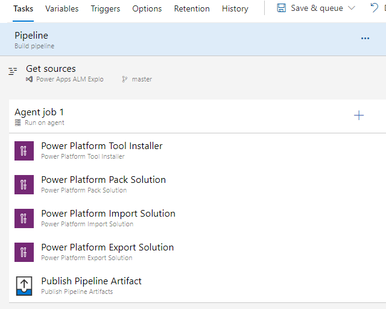{.lb .lb-img-noborder lb-cust-margin width="100%" noborder="yes"}
*Abbildung: Azure DevOps Pipeline Tasks*

Für diesen Zweck werden im Kontext der Pipeline die beiden Tasks »Power Platform Import Solution« und »Power Platform Export Solution« verwendet. Bei letzterem Task ist es wichtig, dass die Option »Export as Managed Solution« aktiviert ist.

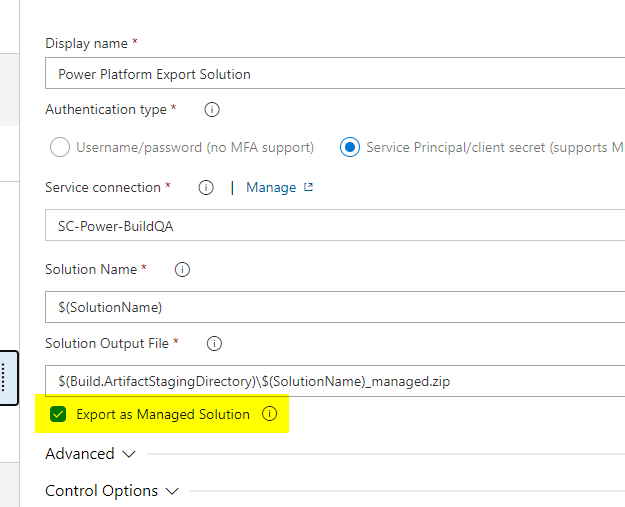{.lb .lb-img-noborder lb-cust-margin width="100%" noborder="yes"}
*Abbildung: Option »Export as Managed Solution«*

Im letzten Schritt der Pipeline wird die exportierte Solution als Pipeline Artefakt veröffentlicht. Dieser Schritt ist wichtig, damit die erstellte Solution im Kontext des Releases dann nachgelagert in die Produktionsumgebung ausgerollt werden kann.

### Deployment nach PROD

Mittels eines Release wird zuletzt die Solution Richtung »PROD« ausgerollt. Hierbei muss in den »Artifacts« zunächst das vorher erstellte Artefakt mit dem Release verknüpft werden.

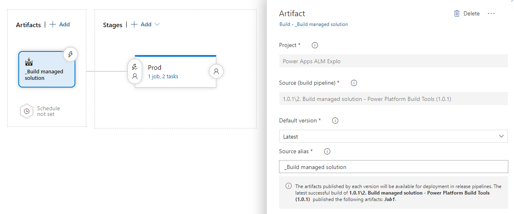{.lb .lb-img-noborder lb-cust-margin width="100%" noborder="yes"}
*Abbildung: Release Pipeline - Artefakt Eigenschaften*

Über diesen Weg kann das Artefakt dann wiederum in den Tasks des Release verwendet werden. Wichtig ist, dass der »Alias« des Artefakts Bestandteil der Pfadangabe im Task für das eigentliche Deployment ist. Für diesen variablen Bestandteil steht keine Variable innerhalb von Azure DevOps zur Verfügung. Hintergrund dafür ist, dass in einem Release auch mehr als Artefakt verwendet werden kann und somit keine eindeutige Beziehung zwischen Variable und Artefakt möglich wäre.

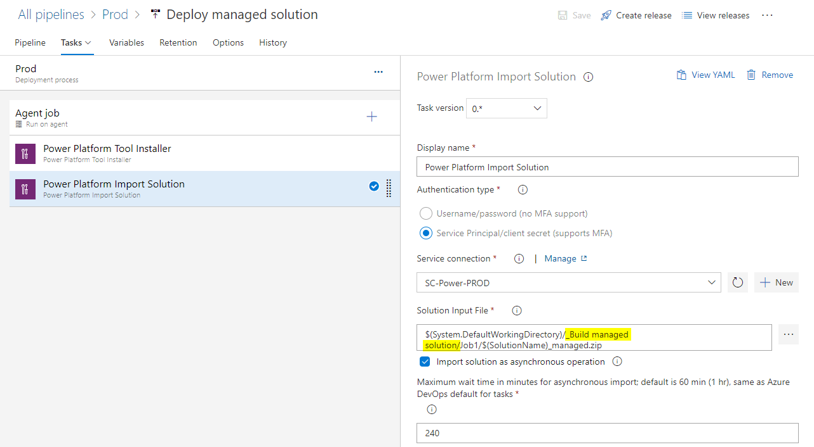{.lb .lb-img-noborder lb-cust-margin width="100%" noborder="yes"}
*Abbildung: Release Pipeline - Artefakt-Alias*

## Tools

Wie zu Beginn erwähnt handelt es sich bei den Power Platform Build Tools im Grunde nur um einen Wrapper um das Tooling für Customer Engagement. Diese können wie in der folgenden Anleitung installiert und genutzt werden.

[Use the SolutionPackager tool to compress and extract a solution file](https://docs.microsoft.com/en-us/dynamics365/customerengagement/on-premises/developer/compress-extract-solution-file-solutionpackager)

Im Anschluss sind alle Werkzeuge installiert, um die zuvor beschriebenen Schritte auch manuell lokal durchführen zu können. An dieser Stelle ist die Empfehlung aber, im Sinne der Zusammenarbeit lieber den ALM-Weg mittels Azure DevOps zu wählen.

## Fazit

Unter Umständen ist ein Entwickler ein anderes Vorgehen gewohnt, wenn es um Versionierung von Quellcode geht. Die Entwicklung auf der Power Plattform bringt aber besondere Eigenheiten mit sich, wozu eben auch ein anderes Vorgehen bei diesem Prozess gehört.

## Quellen

1. [Application lifecycle management (ALM) with Microsoft Power Platform - Power Platform | Microsoft Docs](https://docs.microsoft.com/en-us/power-platform/alm/)
2. [Application lifecycle management (ALM) basics with Microsoft Power Platform - Power Platform | Microsoft Docs](https://docs.microsoft.com/en-us/power-platform/alm/basics-alm)
3. [Configure service connections using a service principal - Power Platform | Microsoft Docs](https://docs.microsoft.com/en-us/power-platform/alm/devops-build-tools#configure-service-connections-using-a-service-principal)
4. [Configure user security in an environment - Power Platform | Microsoft Docs](https://docs.microsoft.com/en-us/power-platform/admin/database-security)
5. [Use Single-Tenant server-to-server authentication (Common Data Service) - Power Apps | Microsoft Docs](https://docs.microsoft.com/en-us/powerapps/developer/common-data-service/use-single-tenant-server-server-authentication#azure-application-registration)

[^1]: "There are two main paths you can use when working with solutions in a source control system:..." - [ALM for developers - Power Platform | Microsoft Docs](https://docs.microsoft.com/en-us/power-platform/alm/alm-for-developers), Abruf: 24.06.2020

