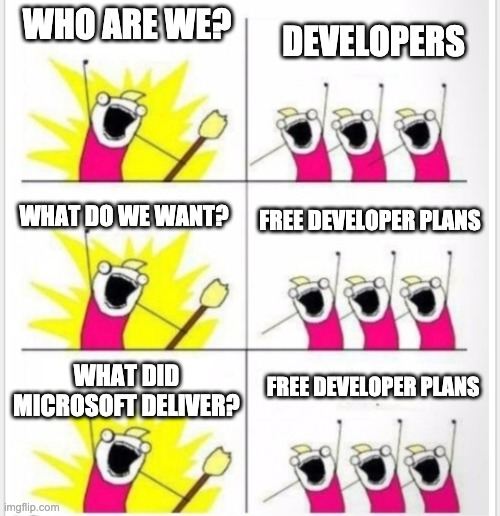

---
title: "Free Power Apps Developer Plan - Finally"
language: en
date: "2021-05-26 19:30:00"
author: André Bering
type: article
content-type: markdown
published: true
language: en
properties:
  tags: ["power apps", "power platform", "dataverse"]
...

For as long as the Power Platform has existed, developers have wanted a free way to experiment with it.  
In 2017, the "Power Apps Community Plan" was [introduced](https://powerapps.microsoft.com/de-de/blog/communityplan/). Even though this was free, it unfortunately did not offer all the possibilities that developers would like to play with.

Since this [Microsoft Build](https://register.build.microsoft.com/), we now know that it takes a bit of time for Microsoft to respond to the developers' pleas, but that the wishes are ultimately fulfilled.

And so the [Power Apps Developer Plan](https://docs.microsoft.com/en-us/powerapps/maker/developer-plan) [was introduced](https://news.microsoft.com/build-2021-book-of-news/#a-512-new-professional-development-tools-for-power-apps-help-developers-deliver-low-code-solutions-) yesterday.
Compared to the old Community Plan, this offers significantly more functions that can be used.

If you want to use your work or school account instead of your personal account, no problem simply look at this guide: [Citizen Dev. Journey - Setting up your Microsoft Power Apps Test Environment | LinkedIn](https://www.linkedin.com/pulse/citizen-dev-journey-setting-up-your-microsoft-power-joe-camp/)

